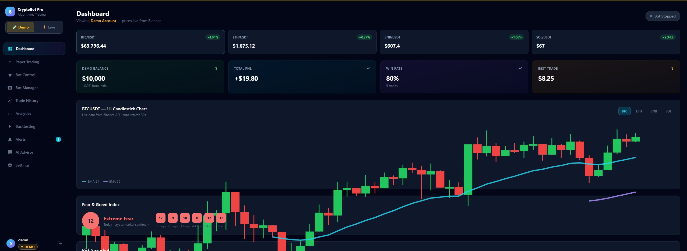
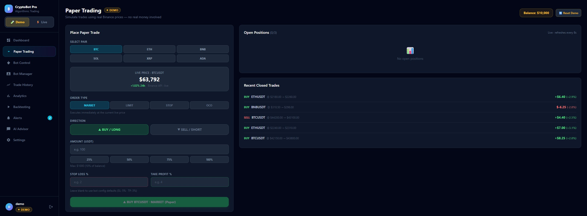
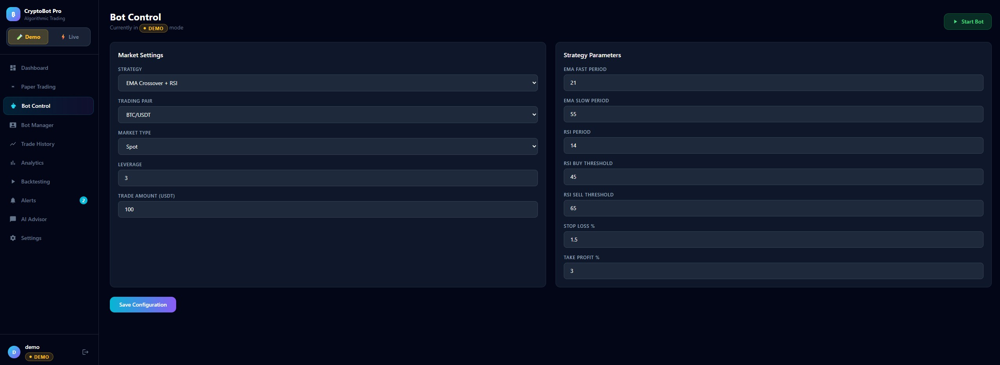

<div align="center">

# ₿ CryptoBot Pro

### Full-Stack Algorithmic Crypto Trading Dashboard

**Paper trade → backtest → deploy bots → go live — all in one beautiful dashboard**

[](https://python.org)
[](https://fastapi.tiangolo.com)
[](https://react.dev)
[](https://tailwindcss.com)
[](https://sqlite.org)
[](LICENSE)

[Screenshots](#-screenshots) · [Features](#-features) · [Quick Start](#-quick-start) · [Strategy Library](#-strategy-library) · [Backtesting](#-backtesting) · [AI Advisor](#-ai-advisor--4-providers-3-free) · [API Reference](#-api-reference) · [Security](#-security)

</div>

---

## 📸 Screenshots

### Dashboard — live prices, candlestick chart with EMA overlay, Fear & Greed index


### Paper Trading — 4 order types, SL/TP, partial close, scale-in


### Bot Control — strategy parameters, risk settings, one-click start/stop


---

## ✨ Features

<table>
<tr>
<td width="50%" valign="top">

### 📊 Dashboard
- Live BTC / ETH / BNB / SOL prices (Binance API)
- Candlestick chart with **EMA fast/slow overlay**
- **Fear & Greed Index** widget (7-day history)
- Portfolio balance, PnL, win rate at a glance
- Risk snapshot — daily loss limit, trade size caps

</td>
<td width="50%" valign="top">

### 🤖 Multi-Bot System
- Run **multiple bots simultaneously** — each with its own pair, timeframe, strategy & capital
- **6 built-in strategies** (see [Strategy Library](#-strategy-library))
- **TP1 partial close → TP2 runner** profit taking
- Trailing stop with **break-even floor** after TP1
- Per-bot PnL, win rate, and live signal check
- ⭐ **Recommended templates** — every config verified profitable in a 12-month backtest

</td>
</tr>
<tr>
<td valign="top">

### 📈 Paper / Live Trading
- **4 order types**: Market, Limit, Stop-Market, OCO
- Per-trade Stop Loss % and Take Profit % with live price preview
- **Partial close** — book 25% / 50% / 75% / 100%
- **Scale-in** — add to a position, auto-recalculated average entry
- Edit SL / TP1 / TP2 / break-even trigger on open positions
- Pending orders auto-fill when price hits trigger

</td>
<td valign="top">

### 🧪 Advanced Backtesting
- Backtest **any of the 6 strategies** on real Binance history (up to 2 years)
- Full position simulation: TP1 partial → TP2, trailing stop, break-even
- Win rate, profit factor, max drawdown, TP/SL hit counts, equity curve
- **Backtest any bot in one click** from its card
- Load any saved bot's config straight into the backtester

</td>
</tr>
<tr>
<td valign="top">

### 💬 AI Advisor — 4 providers, 3 free
- **Groq, Google Gemini, OpenRouter (free)** + Anthropic Claude (paid)
- Switch the active AI with one click in chat
- **Compare All mode** — ask every configured AI at once, answers side by side
- Model selector with **live free-model list** for OpenRouter
- **✨ AI Strategy Designer** — AI builds a bot config from live market data, then backtest or deploy it instantly
- Persistent chat history with clear/delete

</td>
<td valign="top">

### 🔔 Alerts, Analytics & Safety
- In-app notification feed + **Telegram** + **Email (SMTP)** alerts
- Price alerts (above/below target)
- Cumulative PnL chart, weekly/monthly stats, win/loss streaks
- CSV export for taxes/accounting
- Daily loss limit — bots halt automatically
- JWT auth, bcrypt passwords, masked API keys
- Demo mode with $10,000 virtual balance — **no real money, ever**

</td>
</tr>
</table>

---

## 🚀 Quick Start

### Option A — Windows one-click
```
Double-click START_DASHBOARD.bat
```

### Option B — Manual

**Backend**
```bash
cd backend
pip install -r requirements.txt
python main.py
# → http://localhost:8000  (API docs at /docs)
```

**Frontend** (new terminal)
```bash
cd frontend
npm install
npm run dev
# → http://localhost:3000
```

### Option C — One command (Linux / Mac)
```bash
git clone https://github.com/manoranjan2050/CryptoBot_Pro.git
cd CryptoBot_Pro && chmod +x start.sh && ./start.sh
```

**Demo login** → username: `demo` · password: `demo123`

> Database tables and migrations are created automatically on first backend start — no setup needed.

---

## 📐 Strategy Library

Six battle-tested strategies, available for every bot and the backtester:

| Strategy | ID | How it works | Risk |
|---|---|---|---|
| **EMA Crossover** | `EMA` | EMA fast/slow cross + RSI 45–65 filter. Reliable trend-following. | 🟢 Low |
| **MACD + RSI** | `MACD` | MACD 12/26/9 signal-line cross confirmed by RSI. Momentum entries. | 🟡 Medium |
| **Bollinger Bands** | `BB` | Buy lower band (oversold), sell upper band. Range markets. | 🟡 Medium |
| **RSI Reversal** | `RSI_REV` | Buy RSI ≤ 30, sell RSI ≥ 70. Simple mean reversion. | 🟢 Low |
| **Golden Cross** | `GOLDEN` | SMA 50/200 crossover. Few trades, big moves. | 🟢 Low |
| **Supertrend** | `SUPER` | ATR final-band trend flips. Breakout detection. | 🟡 Medium |

### ⭐ Recommended templates (verified by 12-month backtest)

Every template in Bot Manager was selected from a **248-configuration parameter sweep** on real Binance data ($10k balance, $500/trade, Jun 2025 → Jun 2026):

| Template | Strategy | Pair / TF | Backtest result |
|---|---|---|---|
| ETH Trend Master | EMA 21/55 | ETH 4h | **83% win rate · 5.6× profit factor** |
| ETH Supertrend | SUPER 7/2.5 | ETH 4h | 73% win · 1.9× PF |
| SOL MACD Pro | MACD | SOL 4h | **Best total PnL of all 248 configs** |
| SOL MACD Steady | MACD | SOL 4h | 59% win · ~105 trades/yr |
| SOL Breakout | SUPER 14/3.5 | SOL 1h | 64% win · active |
| ETH Scalper | EMA 12/26 | ETH 1h | ~96 trades/yr · 1.4× PF |

> ⚠️ Past backtest performance does **not** guarantee future results. Run templates in demo mode first.

### 🛡️ Smart stop management

```
┌──────────────────────────────────────────────────────────┐
│  ENTRY   →  Stop fixed at entry − SL%   (no noise-outs)  │
│  TP1 hit →  Book 50% profit, remainder keeps running     │
│            Stop trails the high with a BREAK-EVEN FLOOR  │
│            → a winner can never turn into a loser        │
│  TP2 hit →  Close the rest                               │
└──────────────────────────────────────────────────────────┘
```

---

## 🧪 Backtesting

Three ways to backtest:

1. **Backtesting page** — pick any strategy, tune per-strategy parameters, set SL/TP1/TP2/trailing, run on up to 2 years of Binance history
2. **📊 button on any bot card** — backtests that exact bot config in a modal
3. **AI Strategy Designer → Backtest It** — validate an AI-suggested config before deploying

Results include: total return, win rate, profit factor, max drawdown, TP1/TP2/SL hit breakdown, average hold time, full equity curve, and a per-trade log.

---

## 💬 AI Advisor — 4 providers, 3 free

| Provider | Cost | Get a key | Notes |
|---|---|---|---|
| **Groq** | 🆓 Free | [console.groq.com](https://console.groq.com) | 14,400 req/day · blazing fast Llama |
| **Google Gemini** | 🆓 Free | [aistudio.google.com](https://aistudio.google.com) | 1M tokens/day on Flash |
| **OpenRouter** | 🆓 Free | [openrouter.ai](https://openrouter.ai) | 20+ free models · **live model list, auto-fallback when models rotate** |
| **Anthropic Claude** | 💲 Paid | [console.anthropic.com](https://console.anthropic.com) | Best quality · ~$0.001/msg on Haiku |

- Pick the active AI with one click in the chat header — choice is remembered
- **⚡ Compare All** sends your question to every configured AI in parallel
- **✨ AI Strategy Designer** (Bot Manager): give it a pair, timeframe, risk level and optional goal — it returns a complete bot config with reasoning, ready to backtest or deploy

---

## 🏗️ Architecture

```
CryptoBot_Pro/
├── backend/
│   ├── main.py              # FastAPI — all routes, bot runner, backtest engine
│   └── requirements.txt
├── frontend/
│   ├── src/
│   │   ├── App.jsx          # Full React dashboard (single-file, 10 pages)
│   │   ├── main.jsx
│   │   └── index.css
│   ├── package.json
│   └── vite.config.js
├── image/                   # README screenshots
├── START_DASHBOARD.bat      # Windows launcher
└── start.sh                 # Linux/Mac launcher
```

**Data flow**

```
Browser (React) ──► FastAPI (port 8000) ──► Binance API   (prices, klines, account)
                                        ──► AI providers  (Groq / Gemini / OpenRouter / Anthropic)
                                        ──► Telegram API  (alerts)
                                        ──► SMTP          (email alerts)
                                        ──► SQLite        (users, bots, trades, chat, settings)

Background loop (60s): price alerts → pending order fills → legacy auto-bot → multi-bot runner
```

---

## 🗄️ Database Schema

| Table | Purpose |
|---|---|
| `users` | Login credentials (bcrypt hashed) |
| `settings` | Binance keys, AI provider keys, Telegram, email config |
| `bots` | **Multi-bot configs** — strategy, params, capital, SL/TP1/TP2, stats |
| `bot_config` | Legacy single-bot settings (Bot Control page) |
| `funds` | Demo/live balances, risk limits, compounding |
| `trades` | All trades — incl. TP1/TP2 state, scale-ins, break-even, notes |
| `alerts` | In-app notification feed |
| `price_alerts` | Price trigger rules |
| `chat_messages` | **Persistent AI chat history** (per provider) |

---

## 🔌 API Reference

<details>
<summary><b>Click to expand — 50+ endpoints</b></summary>

### Auth & Profile
| Method | Endpoint | Description |
|---|---|---|
| POST | `/api/auth/login` | Login → JWT token |
| POST | `/api/auth/register` | Register new user |
| GET/PUT | `/api/auth/profile` | View / update profile & password |

### Trading
| Method | Endpoint | Description |
|---|---|---|
| POST | `/api/demo/trade` | Place trade (MARKET / LIMIT / STOP_MARKET / OCO + SL/TP) |
| POST | `/api/demo/trade/{id}/close` | Close position at market |
| POST | `/api/demo/trade/{id}/partial-close` | Book 25–100% of a position |
| POST | `/api/demo/trade/{id}/scale-in` | Add capital, weighted avg entry |
| PUT | `/api/demo/trade/{id}/sltp` | Update SL / TP |
| PUT | `/api/demo/trade/{id}/tp-levels` | TP1/TP2/qty%/break-even config |
| GET | `/api/demo/open-trades` | Open + pending positions with live PnL |

### Bots
| Method | Endpoint | Description |
|---|---|---|
| GET/POST | `/api/bots` | List / create bots |
| PUT/DELETE | `/api/bots/{id}` | Update / delete a bot |
| POST | `/api/bots/{id}/start` · `/stop` | Start / stop a bot |
| GET | `/api/bots/{id}/signal` | Live strategy signal for a bot |

### Backtesting
| Method | Endpoint | Description |
|---|---|---|
| POST | `/api/backtest` | Legacy EMA backtest |
| POST | `/api/backtest/advanced` | **Any strategy + TP1/TP2/trailing simulation** |

### AI
| Method | Endpoint | Description |
|---|---|---|
| POST | `/api/chat` | Chat (provider/model override, `all` = compare mode) |
| GET | `/api/chat/providers` | Configured providers + default |
| GET | `/api/chat/models` | Model list (live free list for OpenRouter) |
| GET/DELETE | `/api/chat/history` | Load / clear saved conversation |
| POST | `/api/ai/strategy` | **AI designs a bot config from live market data** |

### Market, Analytics, Alerts, Settings
| Method | Endpoint | Description |
|---|---|---|
| GET | `/api/market/overview` · `/klines/{s}` · `/ema/{s}` · `/fear-greed` | Market data |
| GET | `/api/analytics/pnl-history` · `/summary` · `/streak` | Performance analytics |
| GET | `/api/trades/export` | CSV export |
| GET/POST/DELETE | `/api/price-alerts` | Price alert rules |
| GET/PUT | `/api/settings` | Settings (secrets masked, mask-safe save) |
| POST | `/api/settings/test-binance` | Verify Binance keys (Spot + Futures) |
| POST | `/api/notify/test-telegram` · `/test-email` | Test notification channels |

Full interactive docs at **[http://localhost:8000/docs](http://localhost:8000/docs)** when running.

</details>

---

## ⚙️ Setup Guide

<details>
<summary><b>1 · Binance API keys (Live mode only)</b></summary>

> Demo mode works without any keys.

1. Binance → **Account → API Management → Create API**
2. Enable **Spot & Margin Trading** only — ❌ never withdrawals
3. For Futures: enable IP restriction first, then Futures permission (keys created *before* opening a Futures account never gain Futures access — create a new key)
4. Paste both keys in **Settings → Binance API** → **Test Connection** shows exactly what works

</details>

<details>
<summary><b>2 · Free AI key (recommended: Groq)</b></summary>

1. Sign up at [console.groq.com](https://console.groq.com) (free, no card)
2. API Keys → Create → copy
3. Paste in **Settings → AI Advisor → Groq** → Save
4. Open AI Advisor and chat — switch providers anytime from the chat header

</details>

<details>
<summary><b>3 · Telegram alerts</b></summary>

1. Message **[@BotFather](https://t.me/botfather)** → `/newbot` → copy token
2. Message **[@userinfobot](https://t.me/userinfobot)** → copy your Chat ID
3. **Settings → Telegram** → paste both → toggle on → **Test Telegram**

</details>

<details>
<summary><b>4 · Email alerts (Gmail)</b></summary>

1. Enable 2FA → **Google Account → Security → App Passwords** → generate
2. **Settings → Email**: host `smtp.gmail.com`, port `587`, username = Gmail, password = app password

</details>

---

## 🔒 Security

- **API keys** stored in SQLite, **masked in every API response**, never logged
- Saving settings **cannot overwrite a stored key with its mask** (mask-safe writes)
- Secrets (`.env`, `*.db`, `*.key`, `*.pem`) excluded by `.gitignore`
- **JWT tokens** expire after 7 days · bcrypt password hashing
- Live mode requires explicit confirmation + working Binance keys
- Withdrawal permissions intentionally unsupported — trading only

---

## ⚠️ Risk Disclaimer

> Algorithmic trading involves **substantial financial risk**.
>
> - Backtest results are historical — they do **not** guarantee future returns
> - Always run new bots in **Demo mode** for weeks before going live
> - Start live with **small amounts** you can afford to lose entirely
> - Monitor bots regularly — crypto markets move fast
> - The authors accept no responsibility for financial losses

---

## 📄 License

MIT License — see [LICENSE](LICENSE) for details.

---

<div align="center">

**Built with ❤️ using FastAPI + React + Claude AI**

⭐ Star this repo if it helped you!

**[⬆ Back to top](#-cryptobot-pro)**

</div>
